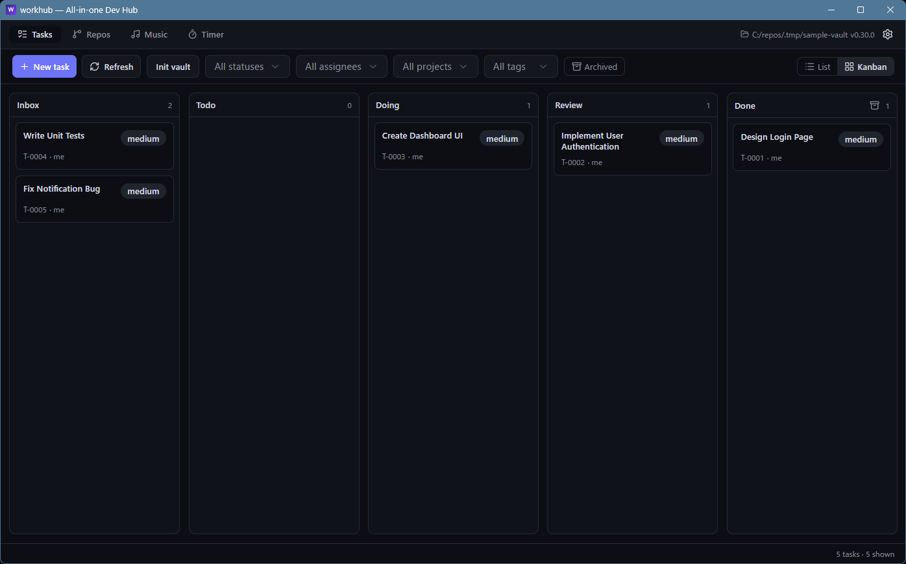
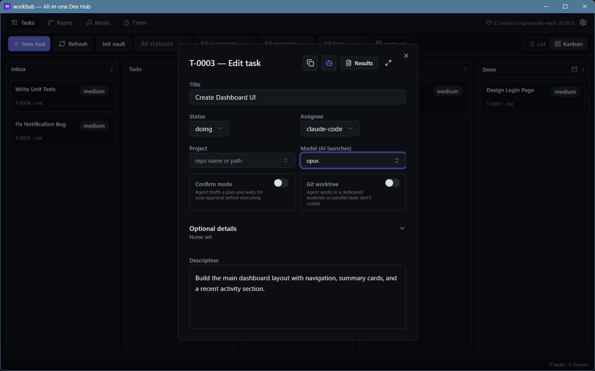
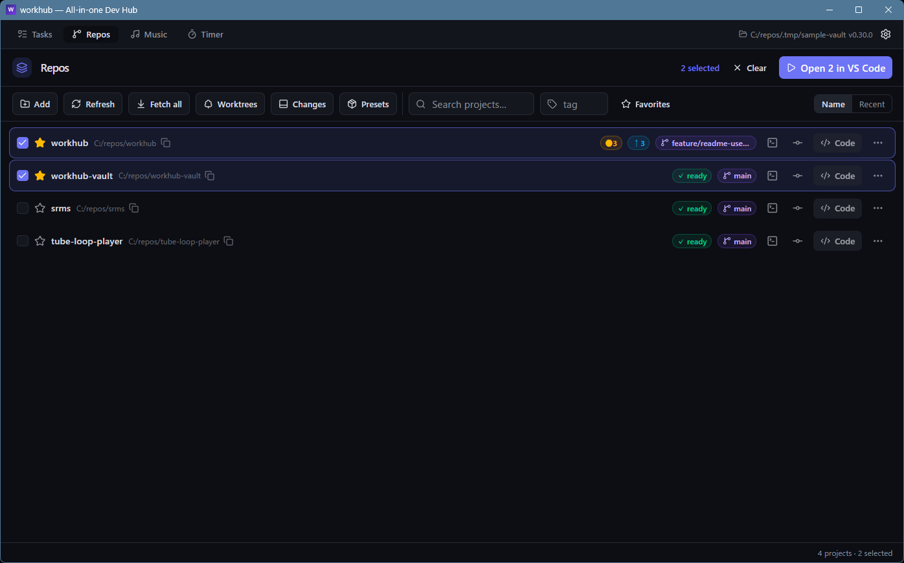
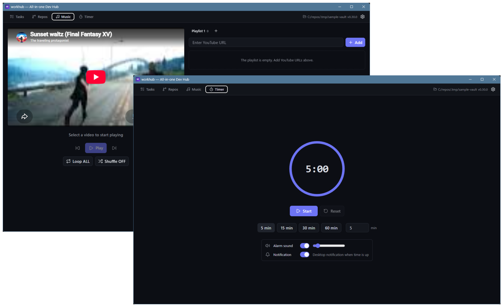
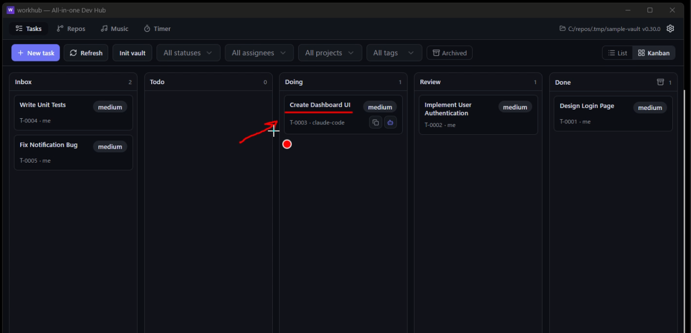
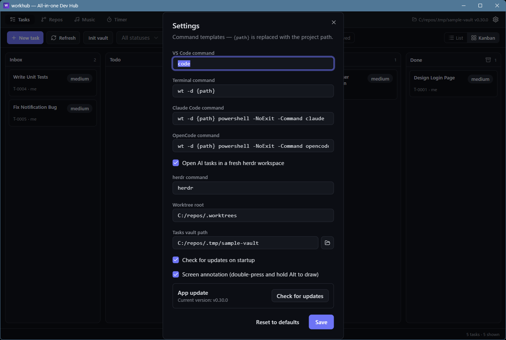
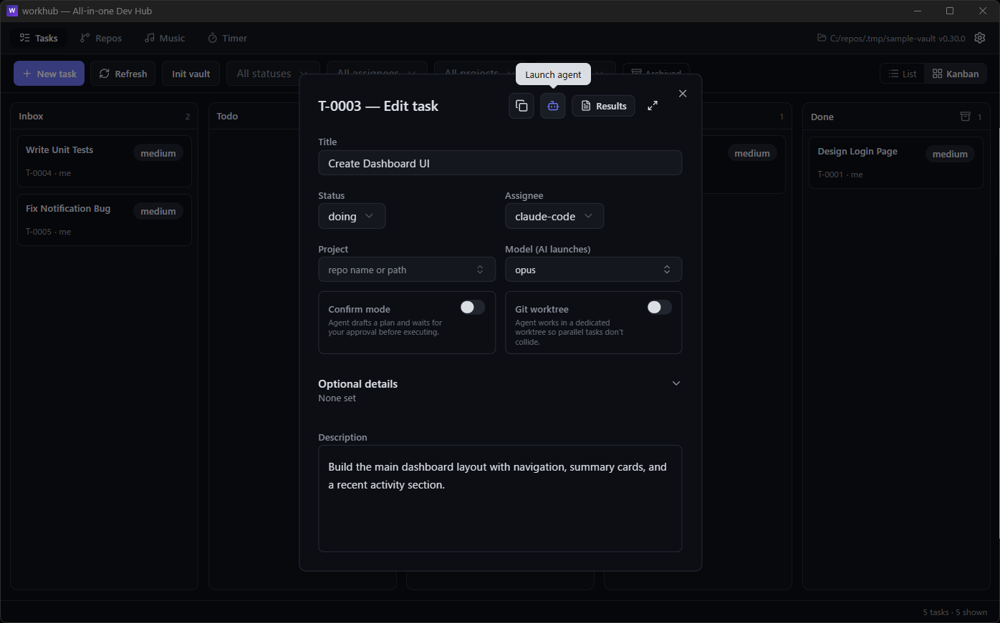

# workhub

**All-in-one Dev Hub** — a Windows desktop app where humans and AI agents
share one task board, plus repository management, a music player, and a
focus timer in a single window.



workhub is the home base for an AI-driven development style: you and AI
agents (Claude Code / OpenCode) work from the same task list, task files and
collected knowledge live in a dedicated Obsidian vault, and everything — the
app, the Claude Code plugin, and the vault template — ships from this one
repository.

## Features

### Tasks — one board for humans and AI

- Every task is a **Markdown file with YAML frontmatter** in the vault
  (`status`, `assignee: me | claude-code | opencode`, `project`, ...). The
  app, Obsidian, humans, and AI agents all read and write the same files.
- **List + kanban views** with filters by status / assignee / project, and
  drag & drop to change status or reorder within a column.
- **Launch AI on a task** — start Claude Code or OpenCode in the task's
  target repository with the task file as context, straight from the card.
- **Live sync** — file watching picks up edits made outside the app
  (Obsidian, agents) instantly.



### Repos — multi-repo dashboard

- Register local repositories and see branch / dirty state at a glance.
- **Git graph** with branch switching, plus a changes panel and a
  **worktrees panel** for reviewing AI tasks running in dedicated worktrees.
- One-click launches: open a repo in VS Code, a terminal, or an AI agent.
- Favorites, tags, and per-repo notes to keep a large repo list organized.



### Music & Timer

- **Music** — a YouTube loop player with playlists persisted alongside your
  config; background music without leaving the hub.
- **Timer** — a countdown timer with presets, desktop notification, and an
  alarm sound for focus sessions.



### Screen annotation (ink)

Double-press <kbd>Alt</kbd> (holding the second press) to draw temporary
strokes anywhere on screen — handy when narrating or reviewing. <kbd>Alt</kbd>
+<kbd>S</kbd> cycles the pen color; releasing <kbd>Alt</kbd> clears the
strokes. Can be disabled in Settings.



## Install

Windows 10/11. Runtime requirement: `git` on PATH (for the Repos tab).

### From GitHub Releases (recommended)

```powershell
$dir = "$env:LOCALAPPDATA\Programs\workhub"
New-Item -ItemType Directory -Force $dir | Out-Null
Invoke-WebRequest "https://github.com/atman-33/workhub/releases/latest/download/workhub.exe" -OutFile "$dir\workhub.exe"
[Environment]::SetEnvironmentVariable("Path", [Environment]::GetEnvironmentVariable("Path", "User") + ";$dir", "User")
```

Open a new terminal and run:

```powershell
workhub
```

Each release also ships `workhub-windows-x86_64.zip` (exe + README + LICENSE)
and `SHA256SUMS.txt` if you prefer manual installation.

workhub checks GitHub Releases on startup; when a newer version exists, a
banner appears at the top — click **Update & restart**. The check can be
disabled in ⚙ Settings.

## Initial setup

### 1. Create the task vault

Tasks live in a dedicated Obsidian vault. On first launch the Tasks tab asks
you to choose a folder — pick an empty one (e.g. `C:/obsidian/workhub-vault`)
and press **Init vault** to expand the bundled template
([`vault-template/`](vault-template)) into it. You can change the vault later
in ⚙ Settings → *Tasks vault path*.

Optionally open the same folder as a vault in Obsidian to browse and edit
tasks and notes directly.



### 2. Install the Claude Code plugin (user scope recommended)

The plugin gives Claude Code the `task-list` / `task-start` / `task-report` /
`vault-init` skills and the accompanying safety hooks. Install it **user
scope** so it is available in every repository a task may target:

```
claude
> /plugin marketplace add atman-33/workhub
> /plugin install workhub@workhub-marketplace
```

The skills locate the vault via `%APPDATA%\workhub\config.json` (written by
the app), or the `WORKHUB_VAULT` environment variable as an override — no
per-repository configuration is needed.

### 3. Register your repositories

In the **Repos** tab press **Add** and pick the local repository folders you
work in. The `project` field of a task refers to these (short name under
`C:/repos/<name>` or an absolute path).

## Usage

### Run a task with AI

1. Create a task in the app and set `assignee` to `claude-code` (or
   `opencode`) and `project` to the target repository; leave it empty to run
   in the vault itself.
2. Press **Launch agent** on the task card (or in the Edit Task dialog).
   The agent starts in the target repository with the task file as context,
   runs `task-start` (status → `doing`), does the work, then `task-report`
   (results into the vault, status → `review`).
3. Review the result — the **Results** button in the Edit Task dialog shows
   the agent's report — and move the task to `done`. Only humans close tasks.



Useful task options (Edit Task dialog):

- **Confirm mode** — the agent drafts a plan and waits for your approval
  before executing.
- **Git worktree** — the agent works in a dedicated git worktree so parallel
  tasks don't collide.
- **Model** — pick the model per task; the opencode catalog is fetched from
  the CLI, recently used models surface on top.

### Edit tasks anywhere

The board and Obsidian are always in sync — drag a card in the app, edit the
same file in Obsidian, or let an agent update it; every side sees the change
immediately. Task descriptions render as Markdown previews (links, code
blocks) in the Edit Task dialog, with a full-screen mode for long specs.

## Repository layout

```
src/            # React frontend (React 19, Tailwind v4, shadcn/ui)
src-tauri/      # Rust backend (Tauri 2)
.claude-plugin/ # Claude Code marketplace definition
plugins/        # workhub Claude Code plugins (skills / hooks)
vault-template/ # initial template for the dedicated Obsidian vault
docs/
```

## Development

Requires Rust and Node.js 22+:

```powershell
npm install
npm run tauri dev           # run with hot reload
npx tauri build --no-bundle # release build -> src-tauri/target/release/workhub.exe
```

## License

MIT — based on [devdeck](https://github.com/atman-33/devdeck) (MIT).
