# workhub

**All-in-one Dev Hub** — a Windows desktop app where you and your AI agents
work from the same task board, backed by a plain-Markdown Obsidian vault.

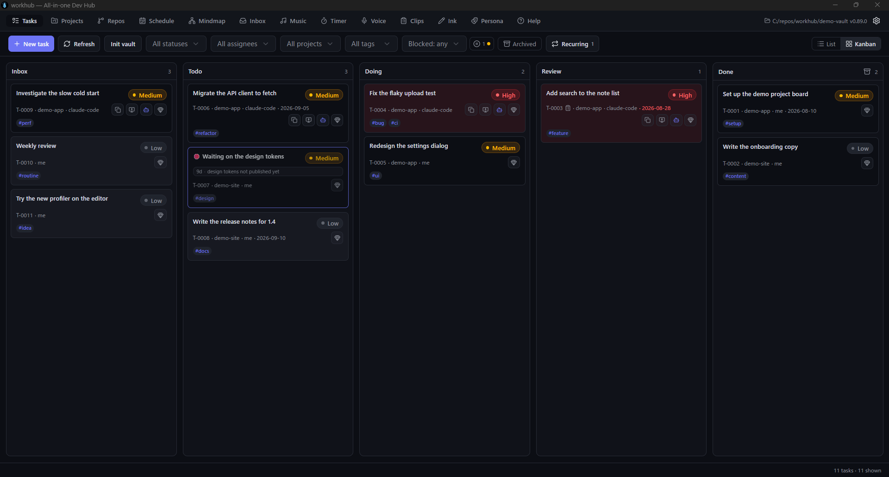

## What it is

workhub is the home base for an AI-driven development style. Tasks, project
notes, schedules and collected knowledge live as Markdown files in a dedicated
Obsidian vault; the app is a window onto those files, and Claude Code /
OpenCode agents read and write the very same ones. You hand an agent a task
from a card, it works in the target repository, and its report comes back into
the vault for you to review.

Around that core it also carries the things a working day keeps reaching for —
a repo dashboard, date and idea planning, dictation, snippets, screen
annotation, music and a timer — so the day does not fragment across six
windows.

It is a personal tool, built in the open. Windows 10/11 only.

## Concept

One rule explains most of the design: **the vault is the source of truth, and
everyone edits it directly.**

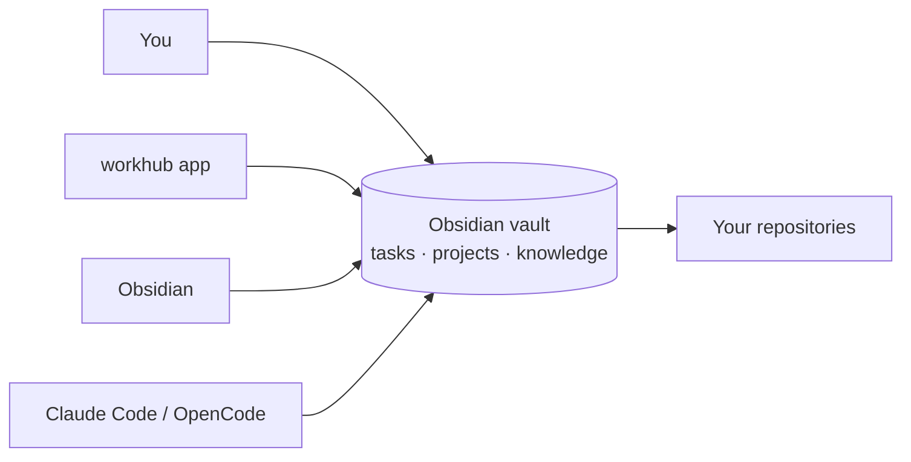
```mermaid
flowchart LR
    You[You] --> Vault
    App[workhub app] --> Vault
    Obsidian[Obsidian] --> Vault
    Agents[Claude Code / OpenCode] --> Vault
    Vault[("Obsidian vault<br/>tasks · projects · knowledge")] --> Repos[Your repositories]
```

- A task is **one Markdown file with YAML frontmatter** — `status`,
  `assignee: me | claude-code | opencode`, `project`, `priority`, `due`.
- Drag a card in the app, edit the file in Obsidian, or let an agent update
  it: all three write the same file, and every side sees the change at once.
- Nothing is locked inside a database, so the day you stop using the app you
  still have every note.

Two settings files sit either side of that vault: `~/.workhub/config.json`
holds what belongs to *this machine* (registered repositories, command
templates, hotkeys), and `<vault>/.workhub/settings.json` holds what belongs to
*this vault* (agent language, custom prompt, recurring rules) and travels with
it to another PC.

## Install

Requires Windows 10/11 and `git` on `PATH`. For the AI half you will also want
[Claude Code](https://claude.com/claude-code) and Node.js 20+; Obsidian,
[OpenCode](https://opencode.ai) and [herdr](https://herdr.dev) are optional.

### From GitHub Releases (recommended)

```powershell
$dir = "$env:LOCALAPPDATA\Programs\workhub"
New-Item -ItemType Directory -Force $dir | Out-Null
Invoke-WebRequest "https://github.com/atman-33/workhub/releases/latest/download/workhub.exe" -OutFile "$dir\workhub.exe"
[Environment]::SetEnvironmentVariable("Path", [Environment]::GetEnvironmentVariable("Path", "User") + ";$dir", "User")
```

Open a new terminal and run:

```powershell
workhub
```

Each release also ships `workhub-windows-x86_64.zip` (exe + README + LICENSE)
and `SHA256SUMS.txt` for manual installation.

workhub checks GitHub Releases on startup; when a newer version exists a banner
offers **Update & restart**. It can be turned off in ⚙ Settings.

## Quick start

The fastest path is the `vault-setup` skill: open Claude Code in the folder you
want as your vault and run it — it checks the prerequisites, initializes the
vault, and wires up the plugins. By hand, it is four steps.

### 1. Create the vault

On first launch the **Tasks** tab asks for a folder. Pick an empty one (e.g.
`C:/obsidian/workhub-vault`) and press **Init vault** to expand the bundled
template ([`vault-template/`](vault-template)) into it. It can be changed later
under ⚙ Settings → *Vault* → *Tasks vault path*.

Open the same folder as a vault in Obsidian if you want to browse and edit the
notes by hand.

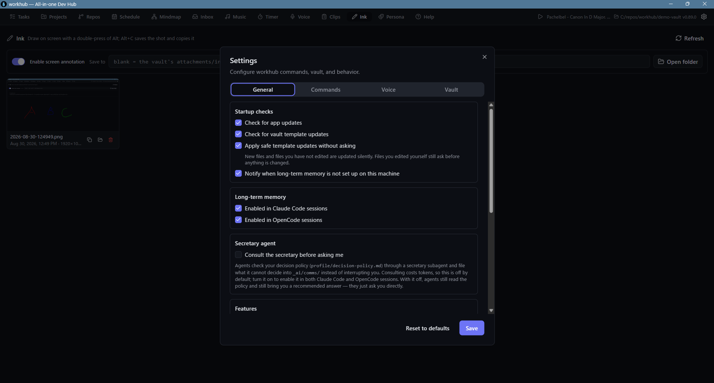

### 2. Install the Claude Code plugins

A vault created from the template already enables `workhub`, `engineering` and
`obsidian` — accept the trust prompt on first launch and you are done. To
install them by hand:

```bash
claude plugin marketplace add atman-33/workhub

claude plugin install workhub@workhub-marketplace --scope project
claude plugin install engineering@workhub-marketplace --scope project
claude plugin install obsidian@workhub-marketplace --scope project
```

The `workhub` plugin is what gives agents the `task-start` / `task-report`
skills and the accompanying safety hooks. It finds the vault through
`~/.workhub/config.json` (written by the app) or the `WORKHUB_VAULT`
environment variable — no per-repository configuration. See
[`docs/plugins.md`](docs/plugins.md) for the full catalog.

### 3. Register your repositories

In the **Repos** tab press **Add** and pick the repository folders you work in.
A task's `project` field points at one of them, by short name (a folder under
`C:/repos/`) or by absolute path.

### 4. Run your first AI task

1. Create a task; set `assignee` to `claude-code` (or `opencode`) and
   `project` to the target repository — leave it empty to run in the vault
   itself.
2. Press **Launch agent** on the card. The agent starts in that repository with
   the task file as context, runs `task-start` (status → `doing`), does the
   work, then `task-report` (results into the vault, status → `review`).
3. Review it — **Results** in the Edit Task dialog shows the report — and move
   the task to `done`. Only humans close tasks.

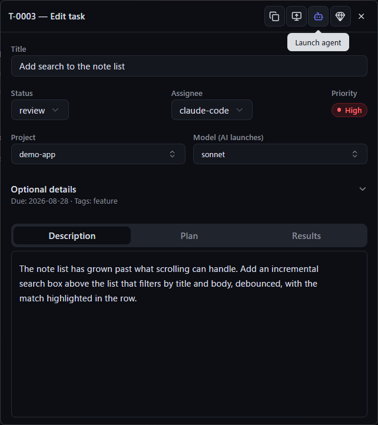

Worth knowing on the Edit Task dialog: **Confirm mode** makes the agent get its
plan approved before executing, **Git worktree** gives it a dedicated worktree
so parallel tasks cannot collide, and **Model** picks the model per task. Two
more buttons sit beside **Launch agent**: **Copy prompt**, and **Send to
Claude Desktop** for when you would rather not open a terminal.

## Features

Each feature is documented in full in the app's own **Help** tab — that is the
manual, and it always matches the version you are running. This is the map.

### The core

| | What it does |
|---|---|
| **Tasks** | The board. List and kanban views, filters by status / assignee / project, drag & drop, live sync with whatever edits the files outside the app. Launch an agent, copy its prompt, or send it to Claude Desktop. |
| **Projects** | The vault's `projects/` folders — where a piece of work's notes, schedules, mindmaps and deliverables live. Create, archive and restore them; link one to a registered repository; pin the ones in flight to the top and drag the list into the order you want. |
| **Repos** | The multi-repo dashboard. Branch and dirty state at a glance, a git graph with branch switching, a changes panel, and a worktrees panel for reviewing the tasks agents are running in isolation. Open any repo in VS Code, a terminal, or an agent. |

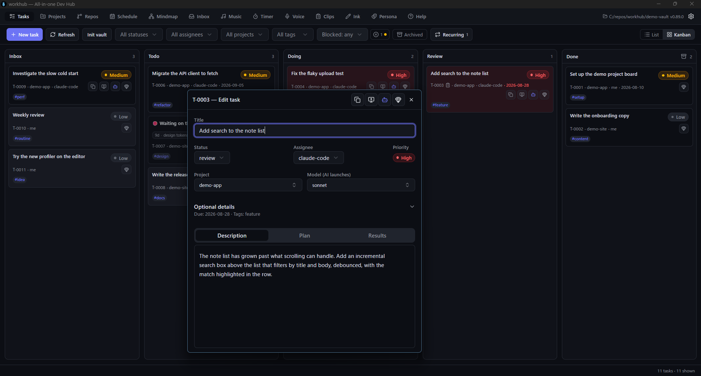

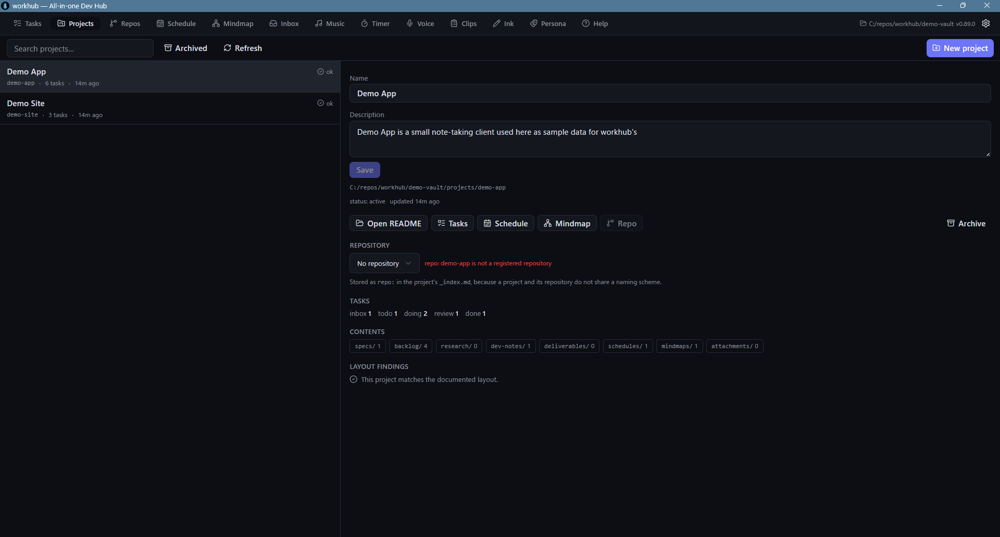

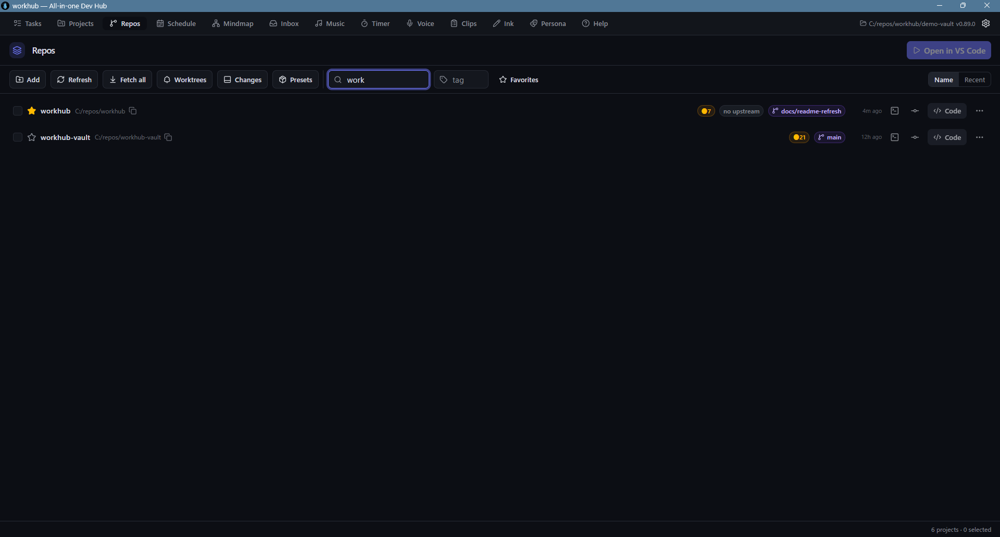

### Planning and thinking

| | What it does |
|---|---|
| **Schedule** | A whiteboard for *deciding* dates: bars, estimate arrows, milestones and notes on a week grid or a month timeline, with working-day counts and optional sprint numbering. Stored as a readable Markdown note in the project. |
| **Mindmap** | The same idea for branching thoughts — a map that is an ordinary nested bullet list on disk, with colours, task links and sticky notes. Exports as a mermaid block. |
| **Inbox** | The raw notes sitting in the vault's `inbox/`, so what you dropped there to file later stops being invisible outside Obsidian. |
| **Strategist** | `/strategist` reads where you said you were heading (`strategy/`), where you actually are, and what is blocking you — then argues with you about the difference. |

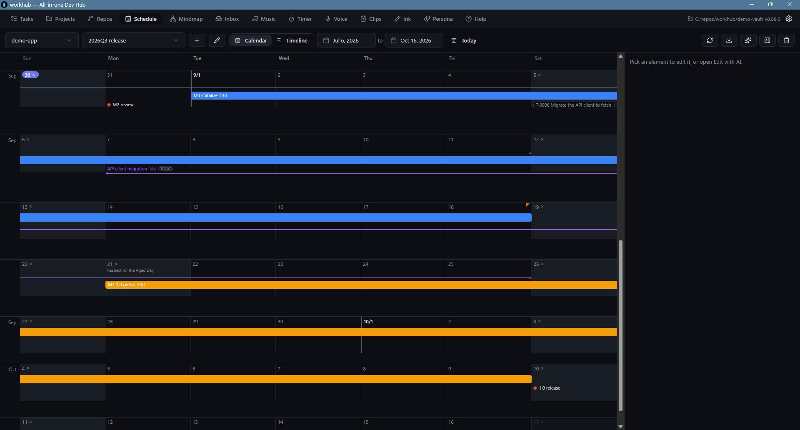

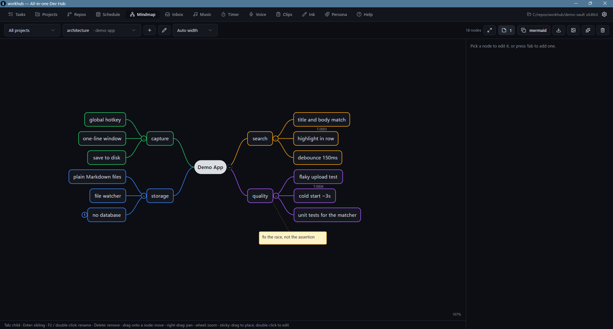

### Working with agents

| | What it does |
|---|---|
| **Long-term memory** | Past sessions, searchable, fully local — no cloud, no LLM. New sessions receive the relevant history automatically. |
| **Your profile** | `profile/about-me.md` and `decision-policy.md` teach agents who you are and how you decide, so they interrupt you less — and arrive with a recommendation when they do. |
| **Custom prompt** | Standing instructions appended to every task prompt an agent receives. |
| **Recurring tasks** | Rules that create a task on a schedule — a daily note, a weekly review, a monthly report. |
| **Vault tidy** | Optional housekeeping: files stale inbox notes and refreshes archive indexes by running an agent headlessly. |
| **Persona** | Picks the character and tone new agent sessions start in (needs the `persona` plugin). |
| **Template updates** | Keeps the vault's shared files in step with the app's bundled template — safe updates apply themselves, conflicts ask, and any of them can be diffed first. |

### The rest of the day

| | What it does |
|---|---|
| **Quick capture** | <kbd>Ctrl</kbd>+<kbd>Alt</kbd>+<kbd>N</kbd> anywhere turns the link on your clipboard into an inbox task, without switching windows. |
| **Voice** | <kbd>Ctrl</kbd>+<kbd>Shift</kbd>+<kbd>Space</kbd> dictates into whatever has focus. Local Whisper, offline. |
| **Clips** | Double-tap <kbd>Ctrl</kbd> for a snippet picker over whatever you are typing in. |
| **Ink** | Double-press and hold <kbd>Alt</kbd> to draw on the screen; <kbd>Alt</kbd>+<kbd>C</kbd> saves the screen with the strokes into the vault, and the Ink tab keeps the captures. |
| **Music / Timer** | A YouTube loop player with playlists, and a countdown timer with presets and an alarm. |

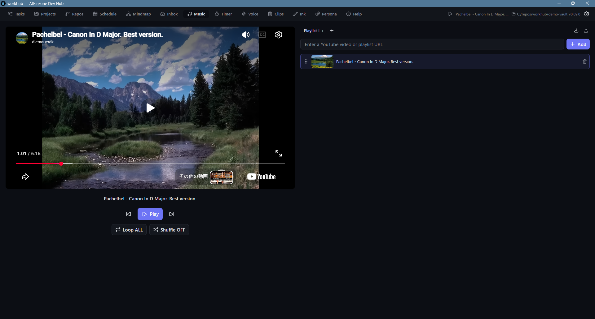

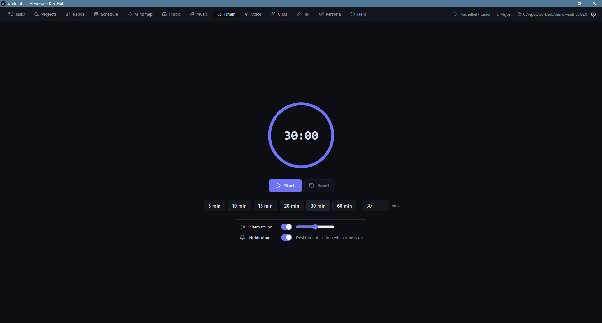

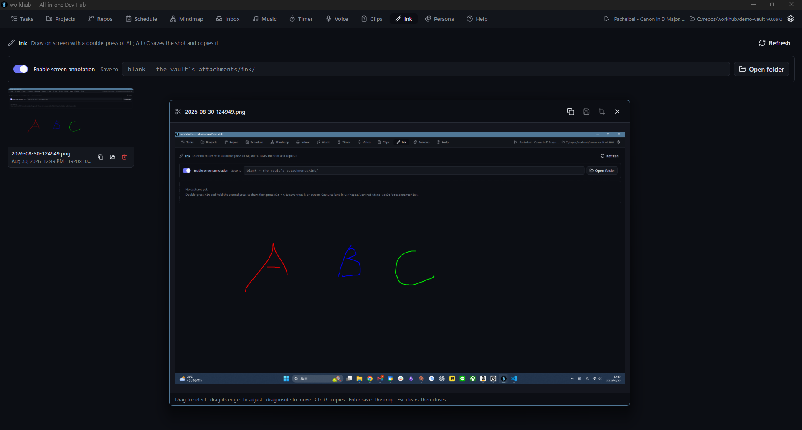

## Repository layout

```
src/            # React frontend (React 19, Tailwind v4, shadcn/ui)
src-tauri/      # Rust backend (Tauri 2)
.claude-plugin/ # Claude Code marketplace definition
plugins/        # workhub Claude Code plugins (skills / hooks / agents)
vault-template/ # the template expanded into a new vault
demo-vault/     # fictional vault used for the screenshots in this README
docs/           # plugin catalog, screenshot procedure, images
```

## Development

Requires Rust and Node.js 22+:

```powershell
npm install
npm run tauri dev           # run with hot reload
npx tauri build --no-bundle # release build -> src-tauri/target/release/workhub.exe
```

Screenshots for this README are taken from `demo-vault/`; the procedure is in
[`docs/screenshots.md`](docs/screenshots.md).

## License

MIT — based on [devdeck](https://github.com/atman-33/devdeck) (MIT).
