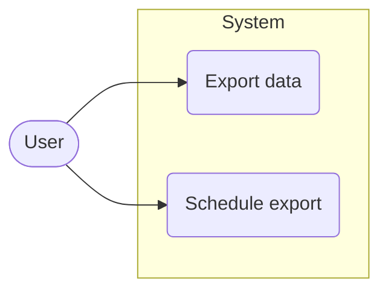
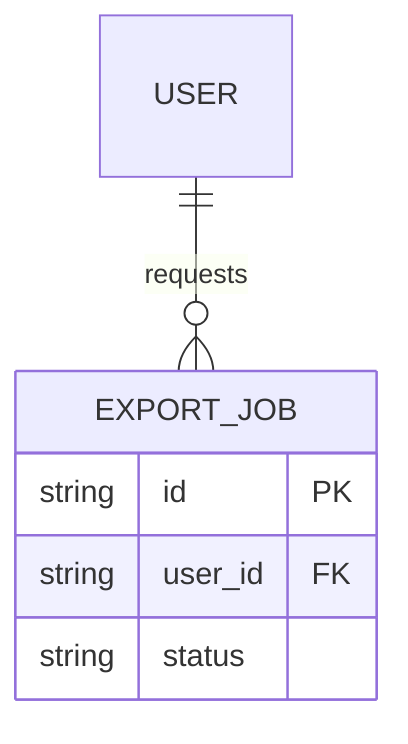
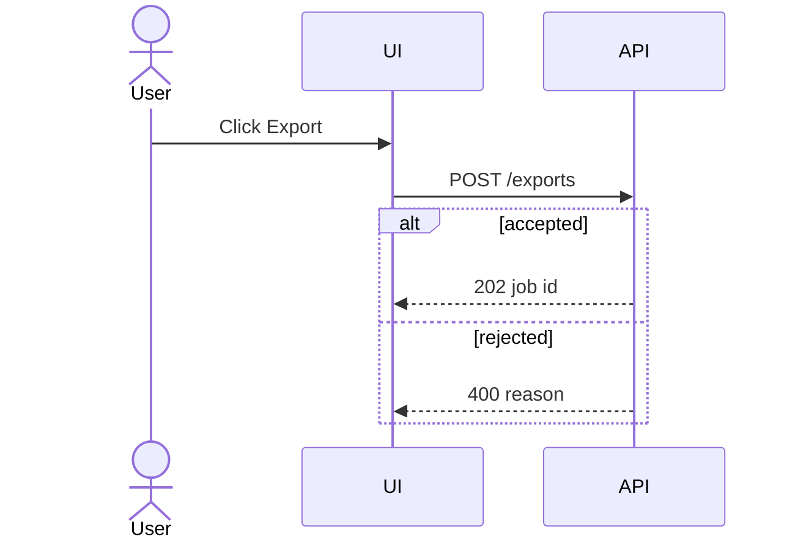
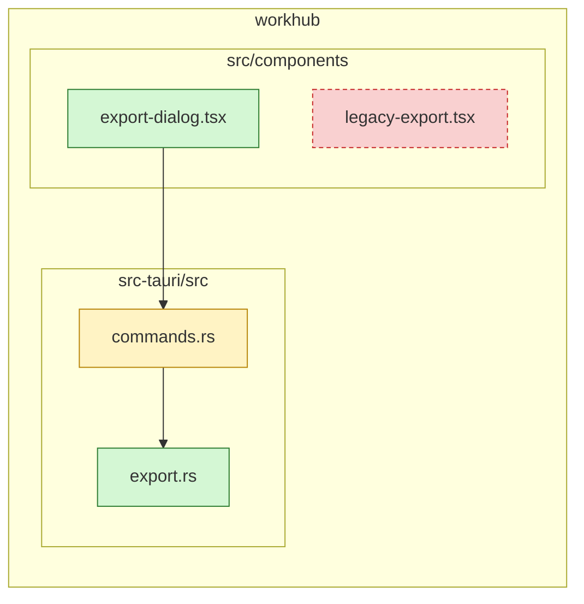

# Diagrams: <change title>

<!--
Pictures for the human reviewer. They illustrate the proposal, specs and design;
they never introduce a decision those files do not contain.

Every diagram is a Mermaid code block (```mermaid). Include only the diagrams
that apply, and list the omitted ones with a reason under "Omitted" at the end.
Keep each diagram small enough to read — about a dozen nodes; split by area
rather than drawing everything at once.
-->

## Use case diagram

<!--
When: the change adds or alters what an actor (user, admin, external system)
can do. Mermaid has no native use case diagram, so draw it as a flowchart:
actors as stadium nodes outside, use cases as rounded nodes inside a system
subgraph.


-->

## ER diagram

<!--
When: entities, their fields or their relationships are added or changed.
Show the entities the change touches plus their direct neighbours; mark new or
changed entities in the prose above the diagram.


-->

## Sequence diagram

<!--
When: a flow crosses components, processes or systems. One diagram per main
flow; include the important failure path (alt/else) where the spec defines one.


-->

## File change map

<!--
When: always, unless no file changes (a pure policy or process design).
The whole picture of where the change lands: repository → area → file, each
file marked added / modified / removed. Group by repository and by area with
subgraphs; list files, not functions. Paths that do not exist yet are
proposals — say so in the prose above.



Arrows are optional; use them only for a dependency the reader needs to see.
-->

## Omitted

<!-- Diagram → reason, one per line. Delete the section if every diagram is present. -->
